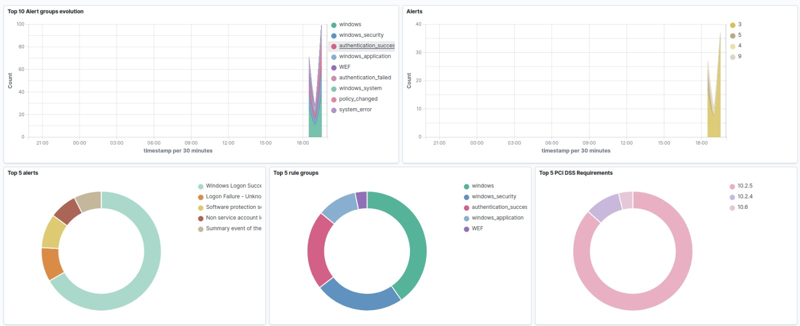
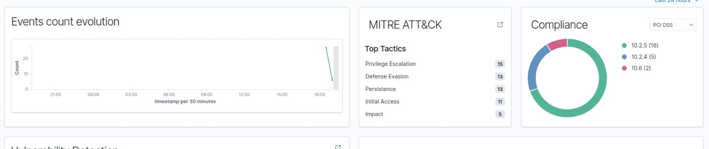
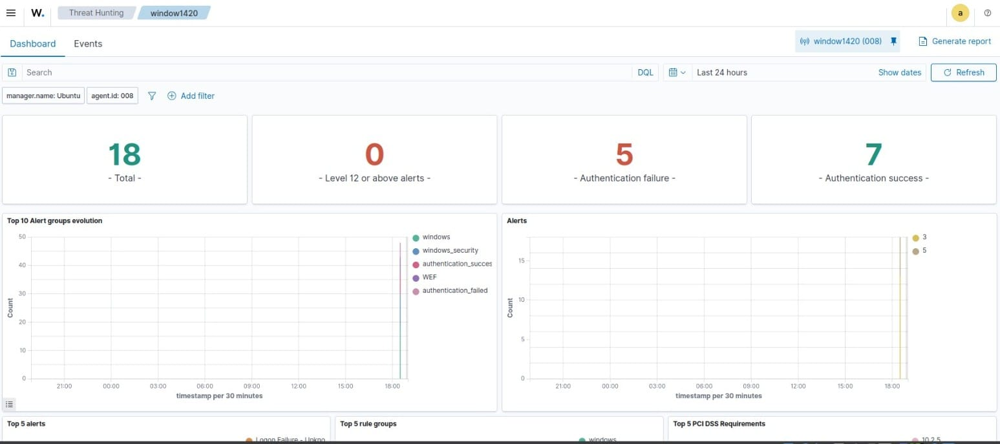
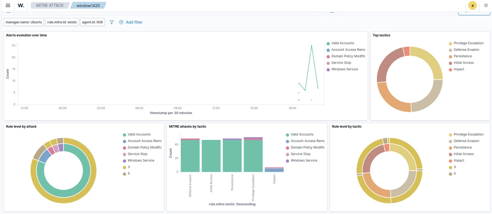

# Wazuh-SOC-Lab
SOC Analyst lab using Wazuh SIEM for log monitoring, authentication failures, and threat hunting

## Project Overview
This project demonstrates the design and implementation of a Security Operations Center (SOC) monitoring dashboard using Wazuh SIEM.  
The goal of this project is to simulate real-world SOC analyst activities such as log monitoring, alert analysis, MITRE ATT&CK mapping, compliance tracking, and vulnerability detection.  
The dashboard provides centralized visibility into security events generated from a Windows endpoint, enabling faster detection, investigation, and response to potential threats.  
This project was built to strengthen my practical skills for a SOC Analyst role and showcase hands-on experience with SIEM tools.

## Objectives
- Monitor security events from endpoints in real time  
- Analyze authentication successes and failures  
- Detect suspicious activities mapped to MITRE ATT&CK techniques  
- Track compliance status (PCI DSS)  
- Identify system vulnerabilities and risk severity  
- Visualize security data in an analyst-friendly dashboard  

## Tools & Technologies Used
- Wazuh SIEM (Security monitoring & log analysis)  
- Elastic Stack (Kibana dashboards)  
- Windows 11 Endpoint (Log source)  
- MITRE ATT&CK Framework  
- PCI DSS Compliance Mapping  
- Virtualized Lab Environment  

## Dashboard Features
### Security Event Monitoring
- Real-time event and alert visualization  
- Alert severity tracking  
- Authentication success and failure analysis  

### Alert & Rule Analysis
- Top alert groups evolution  
- Rule groups and alert distribution  
- Identification of frequent security events  

## MITRE ATT&CK Mapping
Alerts categorized by MITRE tactics:
- Privilege Escalation  
- Defense Evasion  
- Persistence  
- Initial Access  
- Impact  
- Rule-level visibility per tactic  

## Compliance Monitoring
PCI DSS requirement mapping:
- 10.2.5  
- 10.2.4  
- 10.6  
- Visual compliance status overview  

## Vulnerability Detection
- Severity-based vulnerability categorization  
- CVE identification  
- OS and package-level vulnerability insights

## Architecture Diagram

+---------------------+
| Windows 11 Endpoint |
| (Event & Security   |
| Logs)               |
+----------+----------+
           |
           v
+---------------------+
| Wazuh Agent         |
| Log Collection &    |
| Forwarding          |
+----------+----------+
           |
           v
+---------------------+
| Wazuh Manager       |
| Analysis, Rules &   |
| Alert Generation   |
+----------+----------+
           |
           v
+---------------------+
| Elasticsearch       |
| Log Storage &       |
| Indexing            |
+----------+----------+
           |
           v
+---------------------+
| Kibana              |
| Dashboards &        |
| Visualizations      |
+----------+----------+
           |
           v
+---------------------+
| SOC Analyst         |
| Threat Hunting,     |
| Alerts, Compliance  |
+---------------------+

 

**Data Flow Summary:**
1. Security and system logs are generated on the Windows 11 endpoint.
2. The Wazuh agent collects and forwards logs to the Wazuh manager.
3. The Wazuh manager analyzes events using rules and MITRE ATT&CK mappings.
4. Processed alerts are indexed in Elasticsearch.
5. Kibana dashboards provide visualization for SOC analysis, threat hunting, compliance, and vulnerability assessment.

## Dashboard Screenshots

### 1. Threat Hunting Overview

### 2. Events, MITRE ATT&CK & Compliance Summary

### 3. Authentication Activity Analysis

### 4. MITRE ATT&CK Tactics & Techniques Mapping

### 5. Vulnerability Detection Dashboard

### 6. Endpoint Agent Status & Inventory

